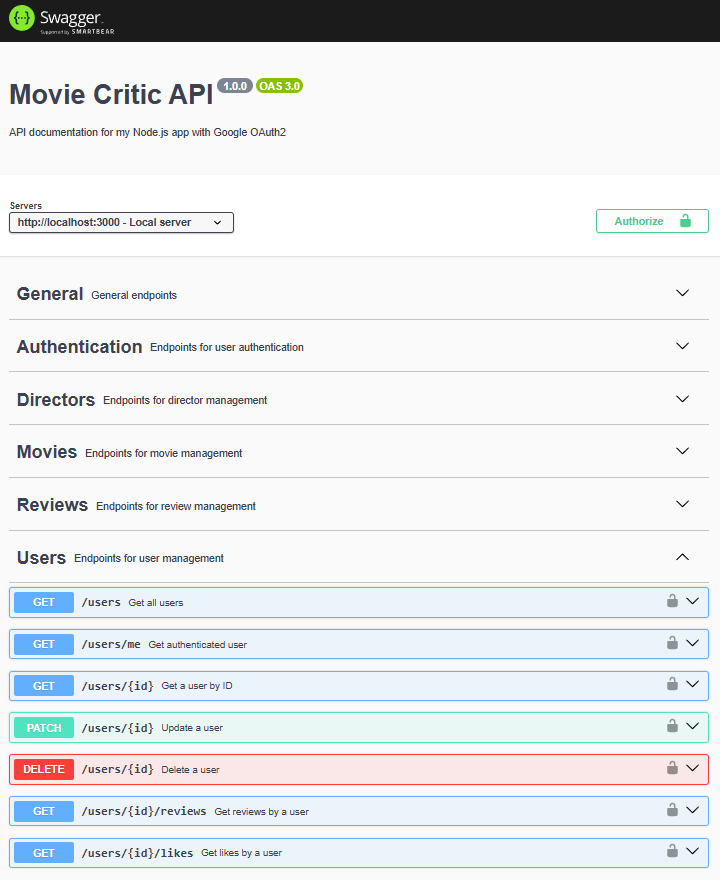

# MovieCritic-API

Repository to host the project developed for 'Web Development 2', a 2nd year subject at UMAIA.

Developed by Group inf24dw2g34: [@jbbernardo7](https://github.com/jbbernardo7)

## Project Description

MovieCritic API is a RESTful web service built with Node.js, Express, and Sequelize that allows users to review and keep track of their favourite movies. It supports user authentication and admin role-based access control, CRUD operations and an API documentation via Swagger UI.

## Features

- User authentication with Google OAuth 2.0
- Admin role-based access control
- CRUD operations for users, movies, reviews, and directors
- Like system for movies
- API documentation via Swagger UI
- Dockerized for easy deployment

## Installation

### Step 1: Clone the Repository
```bash
git clone https://github.com/inf24dw2g34/MovieCritic-API.git
cd MovieCritic-API
```
### Step 2: Set up Google OAuth

- Create a project and OAuth 2.0 client ID at https://console.developers.google.com

### Step 3: Configure Environment Variables
- Copy `.env.example` to `.env`:
  ```bash
  cp .env.example .env
  ```
- Fill in all required variables in `.env` (Google Credentials, etc...)

### Step 4: Build and Run the Project

**Development mode (with live reload):**
```bash
docker compose up --build
```

**Production mode:**
```bash
docker compose -f docker-compose.yml up
```

## API Documentation

After running the project, access the Swagger docs at:  
[http://localhost:3000/docs](http://localhost:3000/docs)

## Repository Organization

* Source Code: [src](src/)
* Report Chapters: [doc](doc/)
* Postman Collection: [collection](postman/)
* Open API Documentation: [docs](src/docs/)

## Gallery


## Technologies

* [JavaScript](https://developer.mozilla.org/en-US/docs/Web/JavaScript)
* [Node.js](https://nodejs.org/en)
* [MySQL](https://www.mysql.com/)
* [Docker](https://www.docker.com/)

### Frameworks and Libraries

* Express.js
* Sequelize (ORM)
* Passport.js
* Swagger
* dotenv
* morgan
* @faker-js/faker

## DockerHub Images

API Image: [inf24dw2g34/moviecritic-api](https://hub.docker.com/repository/docker/inf24dw2g34/moviecritic-api/general)
Database Image: [inf24dw2g34/moviecritic-db](https://hub.docker.com/repository/docker/inf24dw2g34/moviecritic-db/general) (Contains preloaded data)

## Team
* João Bernardo [@jbbernardo7](https://github.com/jbbernardo7)
